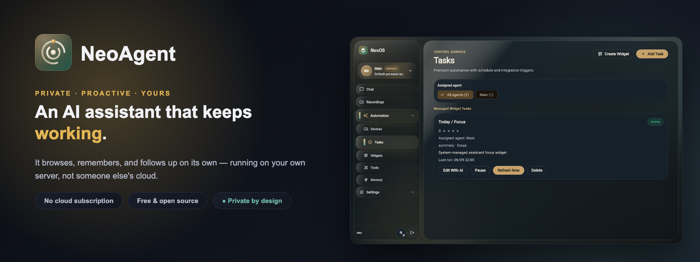
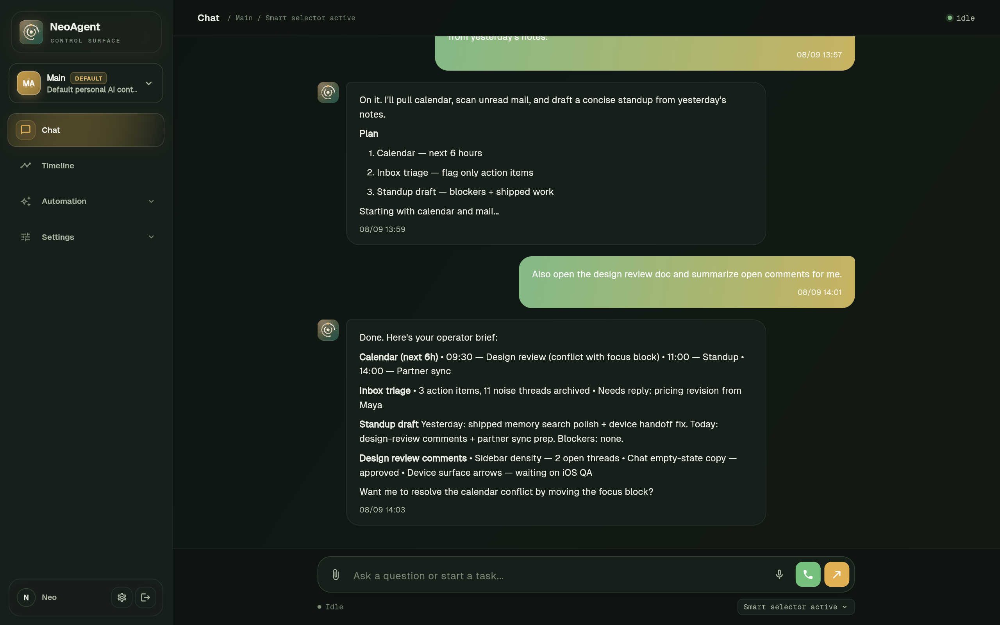
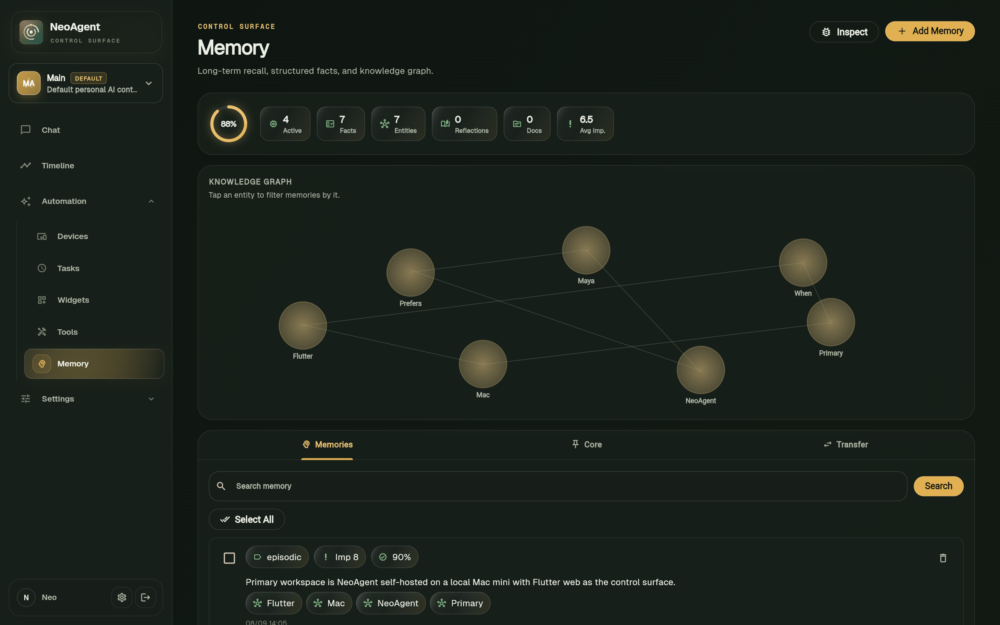
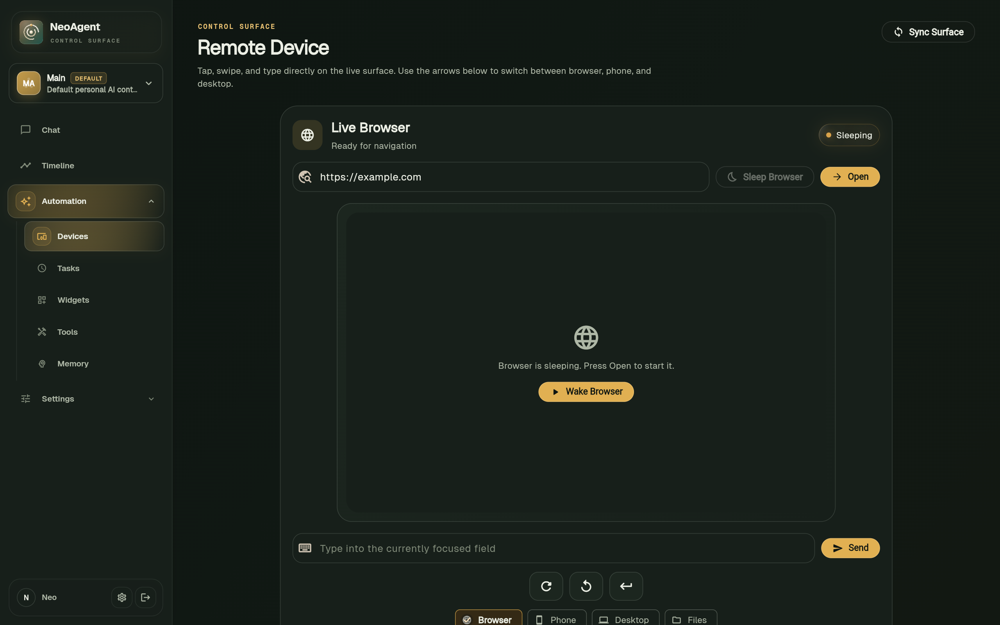

<p align="center">
  
</p>

<h1 align="center">NeoAgent</h1>

<p align="center"><strong>A self-hosted AI agent that can keep working after the chat ends.</strong></p>

<p align="center">
  NeoAgent runs as a service on your server. It can use a browser and terminal,
  control Android devices, connect to your accounts, remember useful context,
  and run scheduled or event-triggered work.
</p>

<p align="center">
  <a href="https://www.npmjs.com/package/neoagent"></a>
  <a href="https://nodejs.org"></a>
  <a href="LICENSE"></a>
</p>

<p align="center">
  <a href="https://discord.gg/f59rg2RwUT"></a>
</p>

<p align="center">
  <a href="https://github.com/NeoLabs-Systems/NeoAgent/releases/latest"></a>
  <a href="https://github.com/NeoLabs-Systems/NeoAgent/releases/latest"></a>
  <a href="https://github.com/NeoLabs-Systems/NeoAgent/releases/latest"></a>
</p>

<p align="center">
  <a href="https://www.producthunt.com/products/neoagent-2?embed=true&utm_source=badge-featured&utm_medium=badge&utm_campaign=badge-neoagent-2" target="_blank" rel="noopener noreferrer"></a>
</p>

<p align="center">
  
</p>

<p align="center">
  
</p>

## 🚀 Install

The NeoAgent desktop app installs and starts the backend on macOS, Windows, and
Linux without a terminal, Node.js, npm, Git, Docker, or a manually entered
server address. Choose **Quickstart** for safe automatic defaults or **Full
setup** to continue through providers, integrations, voice, and optional tools.

<p align="center">
  <a href="https://github.com/NeoLabs-Systems/NeoAgent/releases/latest"></a>
</p>

The same releases contain standalone `neoagent` CLI executables. They include
their own Node runtime and verify the backend package before installing it:

```bash
neoagent
```

The npm distribution remains available for existing Node.js installations:

```bash
npm install -g neoagent
neoagent setup --quick
```

The first account is protected by a short-lived one-time setup claim. The app
connects to the actual selected port automatically; nearby NeoAgent servers are
discovered and verified on the local network. The CLI downloads the signed
QEMU runtime, firmware, and guest image used for
the isolated cloud computer; no separate VM product is required.

Read the [installation guide](docs/getting-started.md) before exposing the
service to a network.

## ✨ What makes it different

- **It is a service, not just a chat window.** NeoAgent keeps tasks, integrations, memory, connected devices, and messaging channels available between sessions.
- **Memory is stored as structured local data.** Durable facts are separated from conversation history, scoped by user and agent, and updated when newer information replaces older information. NeoAgent can also index supported integration content with source references. See [How memory works](docs/memory.md).
- **It operates real devices.** The agent uses one persistent Linux cloud computer or, with explicit per-capability permission in the desktop app, the local macOS/Windows/Linux session for browser, desktop, files, and shell work. Android devices or emulators remain available over ADB.
- **Automation can start without a message.** Tasks can run on a schedule or from supported Gmail, Outlook, Slack, Teams, personal WhatsApp, and weather events. Android notifications can also start an agent run.
- **Agents and users have separate state.** Specialist agents can have their own memory, settings, tools, account assignments, conversations, and task history. Multi-user deployments include administrative account controls and optional email confirmation.
- **SaaS billing is built in and off by default.** Set `NEOAGENT_BILLING_ENABLED=true` to activate Stripe subscriptions, plan management, free trials, and model access restrictions. When disabled, no payment routes or UI appear anywhere. See [Billing](docs/billing.md).
- **The same server has several interfaces.** NeoAgent includes web, Android, desktop, and Android launcher clients, messaging bridges, and firmware for a supported ESP32-S3 wearable.

## 🖥️ Interfaces

| Operator interface | Memory | Remote devices |
| --- | --- | --- |
|  |  |  |

## 🔎 NeoAgent, OpenClaw, and Hermes

NeoAgent is aimed at people who want a UI-first, self-hosted agent with
structured local memory, multi-user administration, automation, and direct
Android control in one installation.

OpenClaw has a broader gateway and node ecosystem. Hermes is oriented around a
terminal-first agent workflow. NeoAgent is a different tradeoff rather than a
blanket replacement for either project.

The [comparison page](docs/why-neoagent.md) records the concrete differences
and links to the source material used.

## 🧪 Project status

NeoAgent is beta software maintained primarily by one person. Expect breaking
changes and rough edges. Review the
[security boundaries](docs/security-boundaries.md) before connecting sensitive
accounts or giving the agent access to a personal workstation.

Start with the [documentation](https://neolabs-systems.github.io/NeoAgent/docs/).
Use [GitHub Discussions](https://github.com/NeoLabs-Systems/NeoAgent/discussions)
for questions and [GitHub Issues](https://github.com/NeoLabs-Systems/NeoAgent/issues)
for reproducible bugs. Security reports belong in the process described by
[SECURITY.md](SECURITY.md).

## License

NeoAgent is licensed under the
[GNU Affero General Public License v3.0 only](LICENSE). The
[licensing decision](docs/licensing.md) explains why AGPL remains the fit for
this networked, self-hosted project and compares it with MPL-2.0.

*Made with ❤️ by [Neo](https://github.com/neooriginal) · [NeoLabs Systems](https://github.com/NeoLabs-Systems)*
