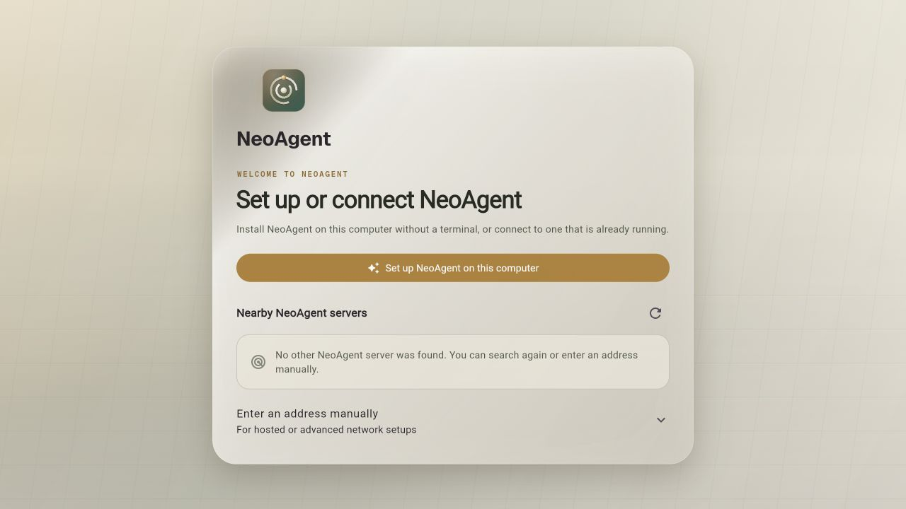
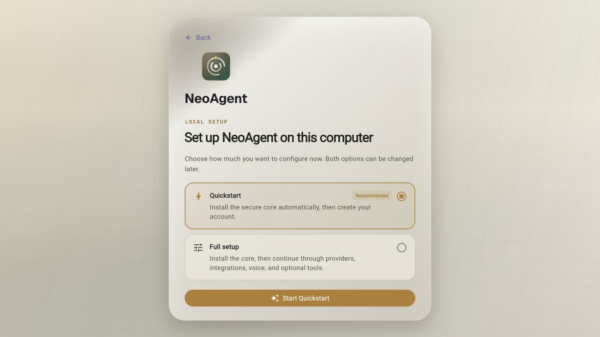

# Installation

NeoAgent can run as a per-user background service on macOS, Windows, and Linux.
Use a machine that remains online when automations, messaging, or remote access
should keep working.

## Install NeoAgent

### Desktop app

Download the desktop app from
[GitHub Releases](https://github.com/NeoLabs-Systems/NeoAgent/releases/latest)
and select **Set up NeoAgent on this computer**. The app downloads the matching
signed runtime, verifies its signature and checksum, activates it atomically,
starts the per-user service, and connects to the selected port.

No terminal, Node.js, npm, Git, Docker, or backend address is required.



Quickstart is recommended, while Full setup stays directly available:



### Standalone CLI

Download the executable for your operating system and processor from the same
release, make it executable on macOS or Linux, and run `neoagent`. The
standalone CLI contains Node and verifies the same runtime packages used by the
desktop app.

The npm package remains compatible for machines that already have Node.js:

```bash
npm install -g neoagent
neoagent
```

The first CLI run detects an existing, incomplete, or damaged installation and
offers the appropriate status, resume, or repair action.

## Choose a setup mode

- **Quickstart** is selected by default. It chooses a private data directory,
  free port, and per-user autostart, installs the working core, and continues to
  protected first-account creation.
- **Full setup** covers installation and network choices, account ownership,
  providers, integrations, voice, and optional browser/media capabilities.
  Optional sections can be completed in the app after the core is running.

Equivalent CLI commands are:

```bash
neoagent setup --quick
neoagent setup --full
neoagent setup --resume
```

The configured port is preserved. New installations choose an available port,
and the app receives the exact address from the setup engine. Nearby instances
are advertised through `_neoagent._tcp.local` and verified with the setup
handshake. Manual addresses are available under the advanced connection option.

## First run

1. Create the first user account.
2. Open **Settings > AI Providers** and connect a hosted provider or local
   Ollama.
3. Select a model and send a message in **Chat**.
4. Open **Settings > Tool Permissions** and review the approval policy before
   enabling browser, shell, file-write, desktop, or Android actions.

The first account requires the one-time claim generated by the local installer.
The claim is short-lived, stored hashed by the server, and never placed in a
normal URL. Each additional person should use a separate account.

Docker, browser isolation, voice, integrations, and media extraction are
optional capabilities. Their absence does not block core setup or sign-in.

## Check the installation

```bash
neoagent status
neoagent doctor
neoagent logs
```

`status` reports configuration, release channel, service state, and server
health. `doctor` performs read-only structured checks. Automation can add
`--json`; each output line follows the versioned setup event schema. Use logs
from the machine hosting the selected NeoAgent instance.

## Next steps

- [Configure a model](models.md) — a fresh install has none set up
- [Connect accounts and messaging](integrations.md)
- [Set up automation](automation.md)
- [Create specialist agents](agents-and-users.md)
- [Review deployment security](security-boundaries.md) — required reading if the server is reachable by anyone but you
