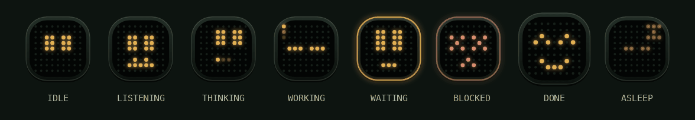

# The mascot

The mascot is NeoAgent's face: a dark tile with a 9×9 dot-matrix screen. It
also shows what the agent is doing right now.

## Where it appears

- **Desktop sidebar**, in place of the logo, live
- **Phone and cowork top bars**, live
- **Chat and cowork replies**, as the assistant's avatar
- **Typing bubble**, thinking while a reply is on its way
- **Landing page**, in the nav and acting out the hero's run log

## What each face means

| State | Face | Shown when |
| --- | --- | --- |
| Idle | Two cursor eyes, blinking now and then | Nothing is running |
| Listening | Eyes plus a level-meter mouth | Voice or wearable input is open, or the voice reply is playing |
| Thinking | Eyes up, three dots counting | The model is reasoning |
| Working | Underscore eyes, a light running round the edge | A tool runs, or a scheduled, task or messaging run is in progress |
| Waiting | Tall eyes, blinking caret, gold rim | A tool needs your approval or a thread needs your input |
| Blocked | Red crosses and a frown | A run just failed; plays once |
| Done | Happy eyes and a smile | A run just finished; plays once |
| Asleep | Closed eyes and a "z" | The connection to the server is down |

## Behaviour

- **Instant.** Sending a message shows Thinking straight away.
- **Quiet at rest.** An idle mascot requests no frames, pauses off screen, and holds still when the system asks for reduced motion.
